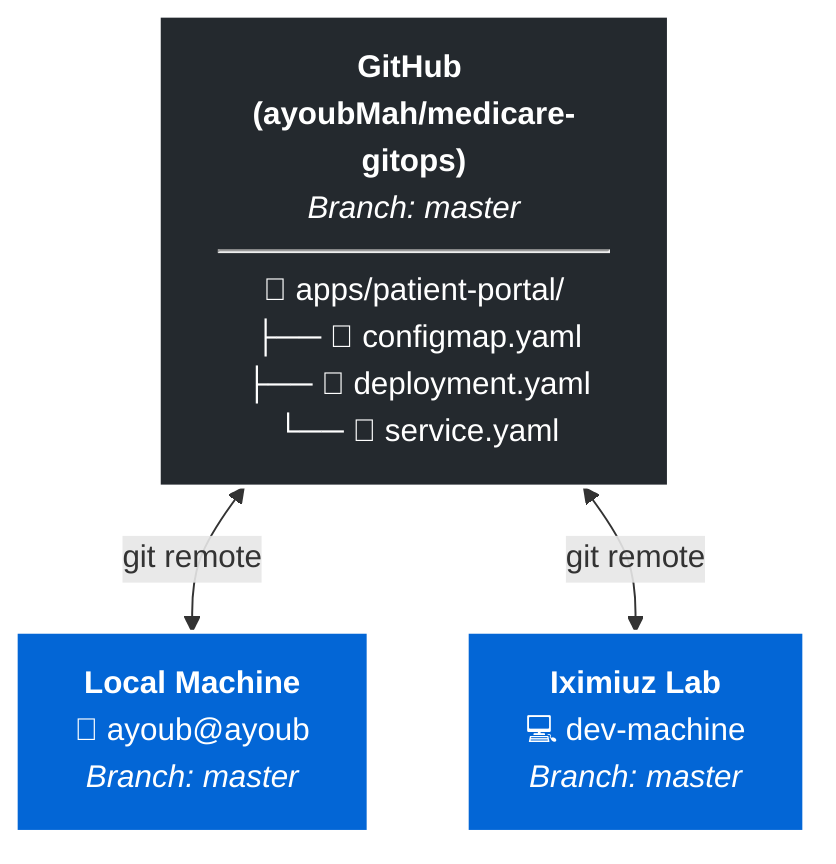

## Current State Summary

```mermaid

flowchart TD
    %% Define the GitHub Remote Node
    GitHub["<b>GitHub (ayoubMah/medicare-gitops)</b><br/><i>Branch: master</i><br/><hr/>📁 apps/patient-portal/<br/> ├── 📄 configmap.yaml<br/> ├── 📄 deployment.yaml<br/> └── 📄 service.yaml"]

    %% Define the Local Workstations
    Local["<b>Local Machine</b><br/>👤 ayoub@ayoub<br/><i>Branch: master</i>"]
    Lab["<b>Iximiuz Lab</b><br/>💻 dev-machine<br/><i>Branch: master</i>"]

    %% Define the Git Relationships
    GitHub <-->|git remote| Local
    GitHub <-->|git remote| Lab

    %% Styling
    classDef remote fill:#24292e,stroke:#fff,stroke-width:2px,color:#fff;
    classDef local fill:#0366d6,stroke:#fff,stroke-width:2px,color:#fff;

    class GitHub remote;
    class Local,Lab local;
```

